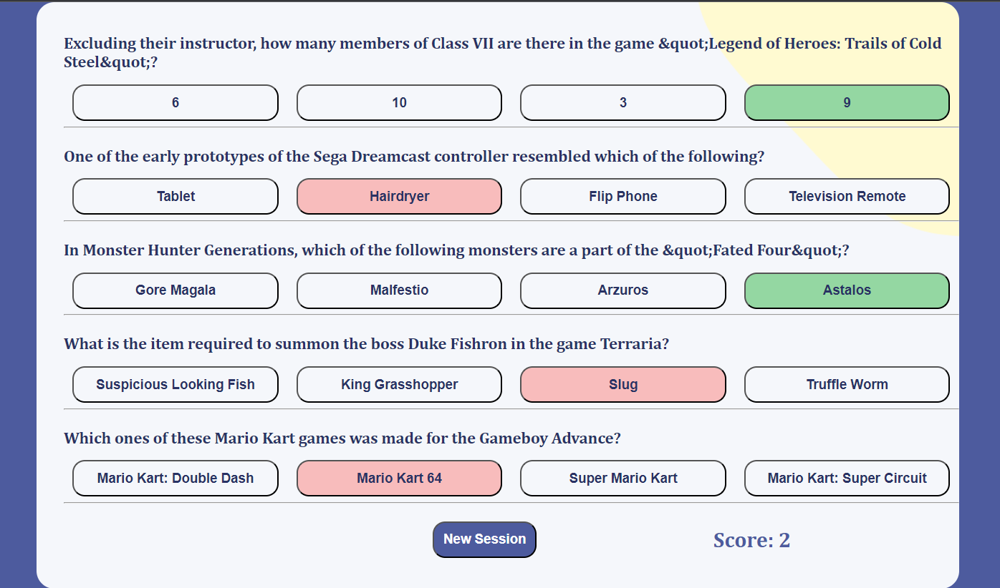

# Quizzical App
This is a React-based trivia game app called "Quizzical". It fetches 5 questions from the Open Trivia Database API, displays them one by one, and allows the user to select an answer for each question. After all the questions are answered, the user can check their score and start a new session.
</img>

# App Components
## App.js
This is the main component of the app that manages the game state. It includes the following states:

- playing: A boolean that determines whether the user is playing the game or not.
- apiquestions: An array that stores the API response containing the 5 questions and their respective answers.
- submitted: A boolean that determines whether the user has submitted their answers or not.
- selections: An object that stores the user's answer selections for each question.
- score: An integer that stores the user's score.
- The useEffect hook is used to fetch the questions from the API when the component mounts and the submitted state is false. It also maps the apiquestions array to render Question components with their respective props. The playing state is used to determine which component to render - Intro or Question.

## Question.js
This component is used to display a single question with its options. It takes the following props:

- id: The question ID.
- playing: A boolean that determines whether the user is playing the game or not.
- score: The user's current score.
- setScore: A function to set the user's score.
- selections: An object that stores the user's answer selections for each question.
- setSelections: A function to set the user's answer selections for each question.
- submitted: A boolean that determines whether the user has submitted their answers or not.
- correct_answer: The correct answer for the question.
- incorrect_answers: An array of incorrect answer options for the question.
- question: The question itself.
- This component maps the incorrect_answers array and the correct_answer to render Option components with their respective props.

## Option.js
This component is used to render a single answer option for a question. It takes the following props:

- id: The question ID.
- score: The user's current score.
- setScore: A function to set the user's score.
- option: The answer option to display.
- submitted: A boolean that determines whether the user has submitted their answers or not.
- selections: An object that stores the user's answer selections for each question.
- setSelections: A function to set the user's answer selections for each question.
- correct_answer: The correct answer for the question.
- This component uses the useEffect hook to check if the user's answer selection is correct and to update the user's score accordingly. It also updates the styling of the button based on the user's answer selection and whether the question has been submitted or not.

## Intro.js
This component is used to display the introduction screen of the app. It takes the following props:

- playing: A boolean that determines whether the user is playing the game or not.
- setPlaying: A function to set the playing state.
- This component displays the game title, a brief description of the game, and a button to start the game. When the button is clicked, it sets the playing state to true.

## Running the App
To run the app locally, clone the repository and run the following commands in the project directory:
`npm install`
`npm start`
The app will open in your browser
